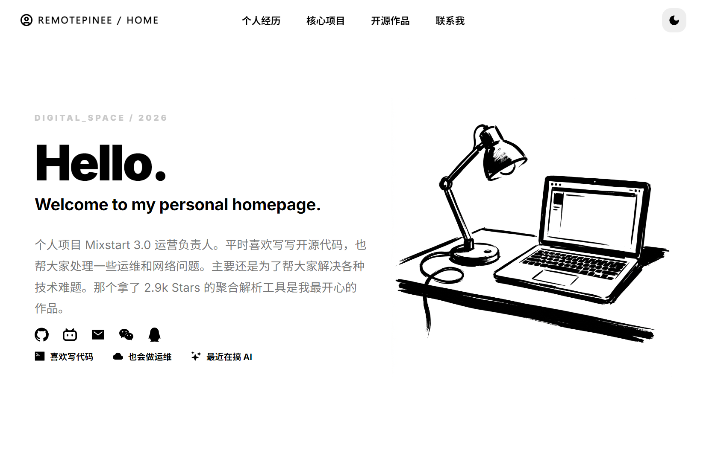
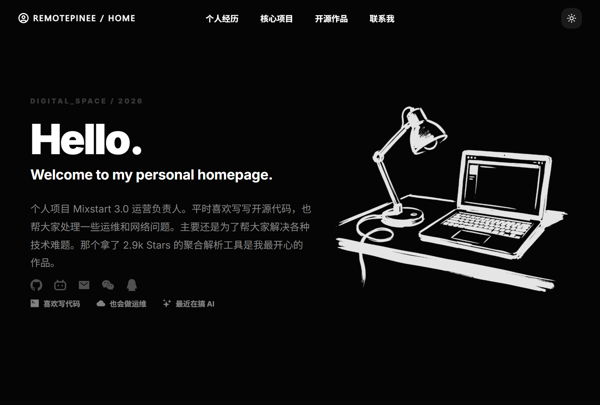

# 🌌 数字空间


**✨ 注：本项目的代码架构、响应式 UI 布局以及核心交互视觉，均由 AI (人工智能) 辅助开发与优化。**

<br>

| 🖥️ 桌面端沉浸展示 | 📱 核心交互矩阵 |
| :---: | :---: |
|  |  |

<br>

## 🚀 特色亮点

- **高级暗黑美学:** 采用深色模式（Premium Dark）设计，结合高对比度色彩、毛玻璃悬浮布局以及极致流畅的过渡动画，打造高级视觉质感。
- **生动的交互体验:** 基于 `framer-motion` 和 `gsap` 实现，包括丝滑的微动画、带有二维码交互的社交链接矩阵，以及全局动态悬浮元素。
- **响应式架构:** 完美适配电脑（Desktop）、平板（Tablet）和手机（Mobile）端，确保全平台展现一致的优雅。
- **模块化展示内容:**
  - **英雄落地页 (Hero Matrix):** 引人注目的首屏设计，直观展示个人核心标签及联系方式矩阵。
  - **履历档案 (Experience Archive):** 结构化呈现过往的核心工作经历、团队管理与技术亮点。
  - **旗舰产品 (Featured Flagship):** 专属的产品展示板块，搭配动态视觉元素，重点推介主理产品 “Mixstart 3.0”。
  - **开源作品集 (Open Source):** 卡片式网格布局，展示高赞开源仓库（如 2.9k Stars 的 AudioVisual）。
  - **联系方式 (Strategic Contact):** 现代化、干净利落的联系模块，期待更高维度的技术交流与机会。

## 🛠 技术栈

- **核心框架:** [Next.js 14](https://nextjs.org/) (App Router / Client Components)
- **开发语言:** TypeScript
- **样式方案:** CSS Modules / 原生 CSS 变量架构
- **动画库:** [Framer Motion](https://www.framer.com/motion/) + GSAP
- **图标库:** `react-icons`, `lucide-react`
- **其他依赖:** `clsx`, `tailwind-merge`, `mouse-follower`

## 📦 如何运行本地项目

请确保你已经安装了 Node.js 环境。然后克隆仓库并安装依赖即可：

```bash
# 1. 克隆项目到本地
git clone https://github.com/RemotePinee/curated-presence.git
cd curated-presence

# 2. 安装依赖
npm install

# 3. 启动本地开发服务器
npm run dev
```

启动后，在浏览器中打开 [http://localhost:3000](http://localhost:3000) 即可预览。

## 🤝 联系我

- **Email:** 614807355@qq.com
- **GitHub:** [@RemotePinee](https://github.com/RemotePinee)
- **Bilibili:** [三块五的仔](https://space.bilibili.com/89020225)

---
*STAY CURIOUS / REMOTEPINEE / 2026*
